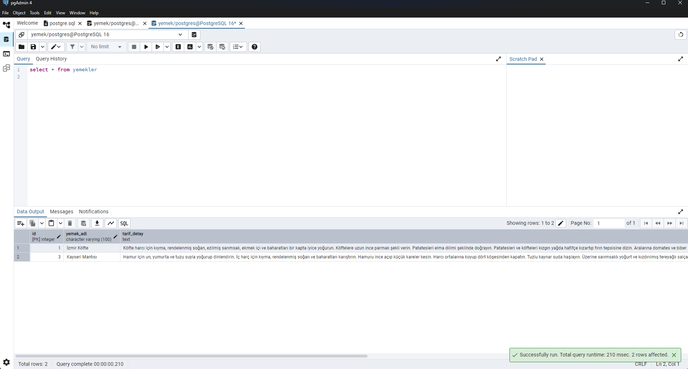
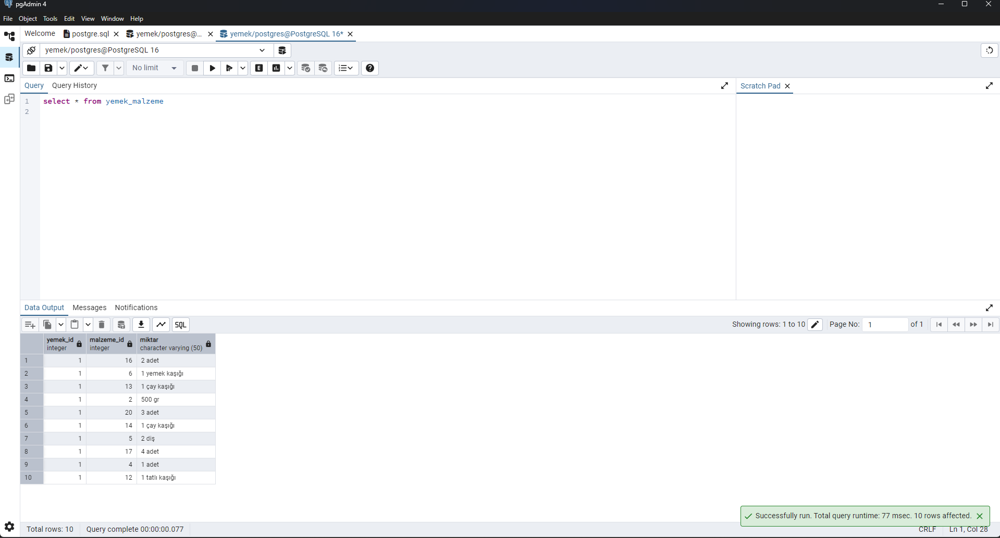
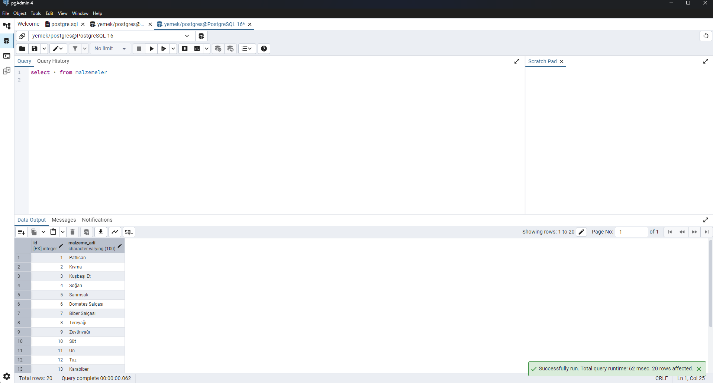
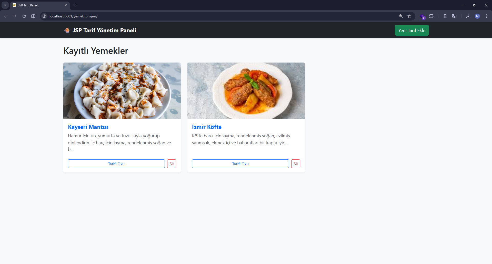
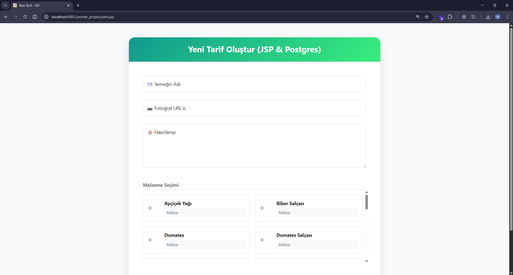
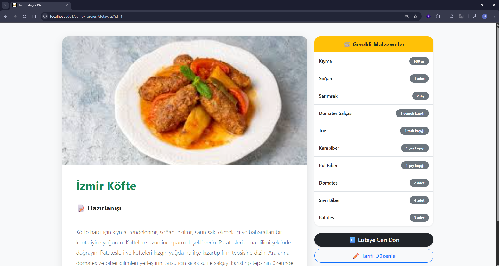
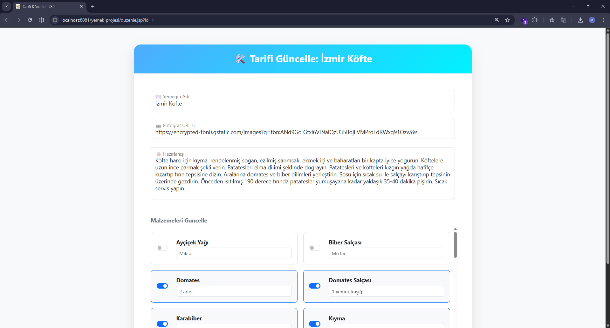

#  Yemek Tarifi Yönetim Sistemi (Java JSP & PostgreSQL)

Bu proje, **Veri Tabanı Yönetim Sistemleri** dersi kapsamında geliştirilmiş; yemek tariflerini, malzemelerini ve bu malzemelerin miktarlarını dinamik olarak yönetmeyi sağlayan bir web uygulamasıdır. Proje, **Java Server Pages (JSP)** teknolojisi kullanılarak geliştirilmiş ve veritabanı tarafında **PostgreSQL** ile desteklenmiştir.

---

##  Özellikler

* **Tam CRUD Operasyonları:** Yemek tarifi ekleme, listeleme, güncelleme ve silme işlemleri.
* **Dinamik Malzeme Yönetimi:** Malzemelerin veritabanından çekilerek form içerisinde dinamik olarak seçilmesi ve miktar girişi.
* **İlişkisel Veritabanı Mimarisi:** Yemekler ve malzemeler arasında **Many-to-Many** (Çoka Çok) ilişki yapısı.
* **Java JDBC Bağlantısı:** Veritabanı işlemleri için `java.sql` kütüphanesi ve PostgreSQL JDBC Driver kullanımı.

---

##  Veritabanı Yapısı

Sistem, verilerin bütünlüğünü korumak adına ilişkisel bir model kullanmaktadır. Tablo yapıları ve içerikleri aşağıdadır:

| Veritabanı Tablosu | Ekran Görüntüsü |
| :--- | :--- |
| **Yemekler Tablosu:** Ana tarif bilgilerini (ad, tarif, foto) tutar. |  |
| **Malzemeler Tablosu:** Sistemde tanımlı tüm malzemeleri tutar. |  |
| **Yemek-Malzeme (Ara Tablo):** Hangi yemekte hangi malzemenin ne kadar olduğunu tutar. |  |

---

##  Uygulama Ekran Görüntüleri

### 1. Ana Sayfa
Kayıtlı tüm yemeklerin PostgreSQL üzerinden çekilerek kart tasarımlarıyla listelendiği ana ekrandır.

### 2. Yeni Tarif Ekleme
Sisteme yeni yemeklerin ve malzemelerin tanımlandığı, Java nesneleriyle veritabanına aktarıldığı ekleme ekranı.

### 3. Tarif Detay Sayfası
Seçilen tarifin içeriği ve kullanılan malzemelerin `JOIN` sorgusuyla ilişkili tablodan çekilerek listelendiği detay ekranı.

### 4. Güncelleme Ekranı
Mevcut tarif bilgilerinin ve malzeme miktarlarının revize edildiği, SQL UPDATE komutlarının tetiklendiği düzenleme alanı.

---

